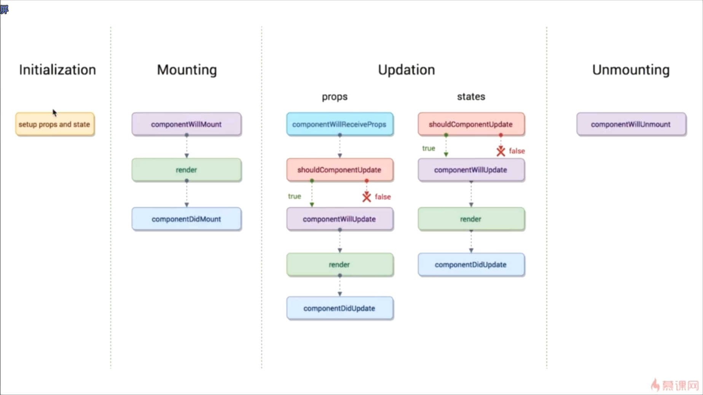

# React

支持IE8以上

Facebook退出，2013年开源 

React Fiber react16之后的叫法，底层算法的改良，更加流畅

面向数据驱动的编程。只要数据改变 页面自己就会变。不用再自己操纵dom了。

理念  all in js  。CSS文件也可以引入到街上js中

我们也只关注数据就可以了

实际开发中可以自底向上（便于测试） 也可以自顶向下（更容易）

声名式开发  

* react vue 只关注数据
* 可以与其他框架并存  （react只管理 挂载到的 id="root" 的页面部分
* 组件化
* 单向数据流   父组件可以向子组件传值，但子组件不能直接修改父组件的数据，告诉父组件，让父组件自己修改（子=>父通信）
* 视图层框架  大型项目中，涉及非父子组件的传值，只用react并不合适，这时需要数据层的、框架，react将自己定位成视图层的框架，并不什么都做
* 函数式编程 

命令式开发  jQuery  大部分时间在操纵dom


##### 与vue对比 

处理 复杂项目时候选择方案更多  灵活性更高

vue 的 api更丰富 实现更简单 但灵活性相对较差


项目的入口文件时 index.js

页面展示的内容是 App.js文件 里 render出来的html

App就是 一个组件 大写字母开头都是组件

引入的react 为 引入react的语法，使其知道大写字母开头的都是组件

reactdom库的意义 是把 内容挂载到 dom节点上

```js
import React, { Component } from 'react';
//↑ 等价于 ↓
// import React from 'react';
// const Component = React.Component
class App extends Component {   
  // 或 import React from 'react';
  // class App extends React.Component 一个 类 继承了 react.component 组件这个类之后就是 一个组件了
  render () {
    return (
      //直接render标签的语法 叫 JSX
    	<div></div>
    )
  }
}
export default App
```


#### 生命周期函数

生命周期函数指在某一个时刻组件会自动调用执行的函数

每个组件 不管是父组件还是子组件 都有这些生命周期函数

render函数就是一个生命周期函数。（constructor其实也是，但它是ES6自带的，不算react的生命周期函数





这个生命周期函数的组合在Fiber（[React Fiber是什么](https://zhuanlan.zhihu.com/p/26027085)）之后就显得不合适了，因为，**如果要开启async rendering，在render函数之前的所有函数，都有可能被执行多次。** 


v16.3新增了两个生命周期函数


* 初始化  在 constructor 进行 定义了state

* mounting  
  * `v17.0将被删除` componentWillMount 在组件即将被挂载到页面的时刻自动执行（第一次挂载的时候      用例 ： 解决首页渲染白屏 
  * render  挂载
  * componentDidMount  组件被挂载到页面之后被自动执行（第一次挂载的时候  

* updation
  * shouldComponentUpdate  组件被更新前，会自动执行  （要return true   组件需要被更新吗？可以使组件不做无谓的render
  *  `v17.0将被删除`  componentWillUpdate 组件被更新之前，shouldComponentUpdata之后 根据其返回结果 执行
  * render
  * componentDidUpdate 组件更新完之后 执行
  * `v17.0将被删除` componentWillReceiveProps    一个组件要从父组件接收参数，（只要父组件的render函数被重新执行了，子组件的这个生命周期函数就会被执行）  如果这个组件第一次存在于父组件中，不会执行。如果这个组件之前已经存在于父组件中，才会执行

* unmounting 
  * componentWillUnmount   当这个组件即将被从页面中剔除的时候，执行   （例：todoitem 条目被删除的时候  render -》 componentWillUnmount -》 componentDidUpdate

* getDerivedStateFromProps 

  无论是Mounting还是Updating，也无论是因为什么引起的Updating，全部都会被调用。 所以生命周期图 那里  getDerivedStateFromProps 要延长

  

  通常来讲，在 `componentWillReceiveProps` 中，我们一般会做以下两件事，一是根据 props 来更新 state，二是触发一些回调，如动画或页面跳转等。在老版本的 React 中，这两件事我们都需要在 `componentWillReceiveProps` 中去做。而在新版本中，官方将更新 state 与触发回调重新分配到了 `getDerivedStateFromProps` 与 `componentDidUpdate` 中，使得组件整体的更新逻辑更为清晰。而且在 `getDerivedStateFromProps` 中还禁止了组件去访问 this.props，强制让开发者去比较 nextProps 与 prevState 中的值，以确保当开发者用到 `getDerivedStateFromProps` 这个生命周期函数时，就是在根据当前的 props 来更新组件的 state，而不是去做其他一些让组件自身状态变得更加不可预测的事情。 

```js
// before
componentWillReceiveProps(nextProps) {  
  if (nextProps.translateX !== this.props.translateX) {
    this.setState({ 
      translateX: nextProps.translateX, 
    }); 
  } 
}

// after
static getDerivedStateFromProps(nextProps, prevState) {
  if (nextProps.translateX !== prevState.translateX) {
    return {
      translateX: nextProps.translateX,
    };
  }
  return null;
}
```

* getSnapshotBeforeUpdate(prevProps, prevState)

  与 `componentWillUpdate` 不同，`getSnapshotBeforeUpdate` 会在最终的 render 之前被调用，也就是说在 `getSnapshotBeforeUpdate` 中读取到的 DOM 元素状态是可以保证与 `componentDidUpdate` 中一致的。虽然 `getSnapshotBeforeUpdate` 不是一个静态方法，但我们也应该尽量使用它去返回一个值。这个值会随后被传入到 `componentDidUpdate` 中，然后我们就可以在 `componentDidUpdate` 中去更新组件的状态，而不是在 `getSnapshotBeforeUpdate` 中直接更新组件状态。 

* componentDidCatch(error, info)   错误处理函数 像 try...catch

setState包含副作用

在 React 正式开启异步渲染模式之后，许多常用组件的性能将很有可能迎来一次整体的提升。进一步来说，配合异步渲染，许多现在的复杂组件都可以被处理得更加优雅，在代码层面得到更精细粒度上的控制，并最终为用户带来更加直观的使用体验。 


注意，这些生命周期函数 除了 render之外 其他都可以不在在组件中进行定义 。因为 我们的组件是继承自 React.component ，内置了除 render外的 生命周期函数

#### JSX

ReactDOM.render(<App/>,document.getElementById('root'))

↑ App之所以是html标签形式 ，就是因为jsx的语法，而这种语法就是 需要React 模块来编译，所以必须引入React

可以在标签中插入{ JS表达式 (!不是语句)}

JSX的语法像 .vue里只能 有一个根元素一样 render出来的 最外层只能有一个包裹元素

​	现在 render可以return 数组或只字符串

```js
render() {
  // 不需要再包裹一层了！
  return [
    // 但是要使用 key
    <li key="A">First item</li>,
    <li key="B">Second item</li>,
    <li key="C">Third item</li>,
  ];
}

render() {
  return 'Look ma, no spans!';
}
```


如果为了防止 flex 布局时候出现问题， 可以将这个包裹标签换为  `<React.Fragment></React.Fragment>` 

fragment 是react16  出现的占位符

也可以 在import 的时候 `import React , {component,Fragment} from 'react'`

react的数据是储存在 constructor 的 this.state 上 

改变 state 数据项 要用 this.setState

this.setState()不只可以传对象，也可以传函数 ，return {} 

```jsx
hanlexxx (e) {
	const value = e.target.value
	this.setState(()=>({   这是 异步的结果 
  	inputValue: value 
	}))
}
// 箭头函数 的this指向也要注意
handlexxx () {
  this.setState((prevState) => ({  //可以接收prevState作为参数 和 this.state表示的一个意思
    list:[...prevState.list,prevState.inputValue],
    inputValue:''
  }))
}
handlexxx () {
  this.setState(() => ({
    list:[...this.state.list,this.state.inputValue],
    inputValue:''
  }))
}
```


JSX中 注释 的写法   `{/*注释*/}`  或 

```jsx
 {
 // 单行注释也可以这样写 ，花括号要换行
 }
```

#### setState

是个异步函数 

接收两个参数 ，第二个参数是一个回调函数

```jsx
handleBtnClick () {
  this.setState((prevState) => ({
    list:[...prevState.list,prevState.inputValue],
    inputValue:''
  }), () => {
    console.log(this.ul.querySelectorAll('div').length)
  }) // 这样写可以返回正确的数量 页面更新之后才执行的
  // console.log(this.ul.querySelectorAll('div').length) 写在这里 会返回正确数量 - 1 
}
```


#### 组件

react中 组件 引入 是 以自闭和标签形式

react中存在父子组件

**父 => 子** 通过 props属性形式向子组件传递参数 传递   `<TodoItem content={item}/>`   

然后在TodoItem组件中 通过 `this.props.content` 访问

**子=>父**  子组件要和父组件通信，子组件要调用父组件传递过来的方法

父组件向子组件传递方法跟传递数据一样 
```jsx
<TodoItem delete={this.delete.bind(this)}/>
```

传递调用方法的时候也要想着绑定，因为我们实际调用的是父组件的方法，在子组件并不能找到这个方法，要绑定

`React里bind就对了……`

**props**

可以进行属性类型强校验    开发时建议书写

子组件可以设置接收属性的数据类型 ，类似vue，但校验方式不一样

要在前面 `import PropTypes from 'prop-types'`

```jsx
TodoItem(组件名).propTypes = { // 注意：这个p要小写，不然会报错
  content: PropTypes.string,  //content这个prop必须是string类型
  xxx: PropTypes.func, //  function类型
  test: PropTypes.string.isRequired,  //不传的prop并不会报错。如果有需要必传，可以加isRequired
  qqq: PropTypes.arrayOf(PropTypes.string, PropTypes.number) // 表示数组里的内容是 字符串 或者 数字
  www: PropTypes.oneOfType([opTypes.string, PropTypes.number])// 表示或者
}
TodoItem.defaultProps = {
  test: 'hello'   //与校验相对应的 ，没有传递值得话，定义默认值，（校验是不isRequired也会生效
}
```


#### render、 props、 state

当传入的state 值变化的时候 render都会运行，所以说 react是数据驱动

当组件的state或props发生改变的时候，render函数就会重新执行

还有 父组件的render函数被运行时，它的子组件的render都将被重新运行一次


react中一个类就是一个组件 继承自 component

而 使用类就允许我们使用其它特性，例如局部状态、生命周期钩子 

（定义为类才可以，函数的话 就没有局部状态 生命周期钩子）

 

某种程度上 因为props不能更改，而出现了state

#### 虚拟DOM

* 如果自己实现 数据和dom的联动该如何做？

  * 数据（state）
  * JSX模板
  * 数据 + 模板 结合生成真实的DOM，来显示
  * 数据发生变化
  * 数据 + 模板 结合，生成真实的DOM，替换原始的DOM

  因为生成了两次完整的 DOM，这样做非常耗费性能

  可以在数据发生变化的时候 ，不直接替换原始的DOM，而是先将新的DOM和原始的DOM做比对，找差异。最后只用新的DOM中的input元素，换掉老的DOM中的input元素 

* react虚拟DOM的做法    虚拟dom本质上就是js对象

  JSX -> createElement -> 虚拟DOM(JS 对象 )-> 真实的DOM

  其实JSX语法 只是将 标签式写法，转换为 对象式写法 

  * 数据（state）

  * JSX模板

  * 数据 + 模板 生成虚拟DOM（虚拟DOM就是一个JS对象，用它来描述真实DOM）

    `['div',{id:'abc'},['span',{},'hello world']]`   这种形式表示 虚拟dom，虚拟dom就是一个对象

  *  用虚拟DOM的结构生成真实的DOM，来显示

    `<div id='abc'><span>hello world</span></div>`

  * state发生变化 

  * 比较原始虚拟DOM和新的虚拟DOM的区别，找到区别是span中内容

  * 直接操作DOM，改变span中的内容

  用react生成对象耗费性能很小，生成dom耗费性能很大

  return <div></div>    =>   return React.createElement('div', {}, 'item')

* diff算法 

  * setState   如果几次setState间隔时间特别短，会合并成一个setState，减少频繁DOM的比对影响性能。所以 setState设计成异步函数

  * 同层比对。   比对的时候会一层层比，如果第一层就不一样了那就不会再继续向下比了，而是直接生成虚拟dom，替换剩下的dom。虽然下面有可能一样，造成性能的浪费，但这样diff更加快，效率更高

  * key值在diff中也起到关键的作用。虚拟dom的比对会以key值做关联。

       所以不要用数组里的 index 做key值 ，不稳定

    ​	没的选了可以用 自己的内容（如 todolist里的 item ）做key值

* ref的应用

  react中 我们通过 e.target来获取 当前操作的dom元素

  ```jsx
  <input ref={(put) => {this.input = put}}/>  // 传进去的put元素指 input这个dom节点  就仿佛使虚拟dom和真实dom相等了
   
  ```

  注意 ：1. react中我们不建议这样做

  ​		2. 因为setState是异步的，会导致获取dom并不及时 （坑

* ReactDOM    

  

  this.renderProtal()   类似  一个 心在 root 中 ，身在 body里 

  ```js
  renderProtal(){
    return ReactDOM.createPortal ((<button>click</button>), document.body)
  }
  render(){
  	return (
  		<div>
         <h1>hello</h1>
         {this.renderProtal()}
      </div>
  	)
  }
  ReactDOM.render(
  	<div>
    	<App/>
    </div>
  )
  
  // 被渲染在 body里，但还是能接收到hello那个div的事件
  
  ```

  


* 利用虚拟DOM的优点 
  * 性能提升
  * 使得跨端应用得以实现 。react native   像移动端 IOS 安卓的原生应用 没有dom的概念，我们的代码只能运行在浏览器。而 虚拟dom生成对象 ，可以将这些对象转为原生应用需要的组件 
  * 原生应用  指 手机上的app

#### React中添加CSS样式

行内样式  `style={{background: 'red'}}` 第一层花括号表示插值 第二层花括号表示 插入的是对象

不能用 class  而是 className （class会被认为是 类的引用

css文件要在入口文件 import进来 

相似的 `<label for=""></label>` 的for也会引起歧义 ，会以为是for循环  要写为 `<label htmlFor=""></label>`

react-transition-group 一个第三方的动画库

#### 需要注意的点：

react中 this 的指向 很重要 因为函数运行起来 会指向当前的元素，所以要将其绑回到前面定义的位置

可以在constructor里 赋值好  this.xxx = this.xxx.bind(this)  **推荐这样写，性能会更好 只赋值一次 减少无谓的渲染**

同理绑定的数据和方法 也可以这样提前 解构赋值 ↓

```jsx
 const {content} = this.props.content
 {content }
```


react中 immutable 的概念 解决不允许我们对state做任何改变 

import {fromJS} from 'immutable'

immutable对象的set方法 会结合之前 immutable对象的值和设置的值，返回一个全新的对象

修改this.state的值得时候要 复制出一个副本来修改 不要直接修改，不方便调试，影响性能

类似的还有immer 可以 和rematch搭配使用 

Immer 是一个支持柯里化，**仅支持同步计算的工具**，所以非常适合作为 redux 的 reducer 使用。 

```js
produce(obj, draft => {

  draft.count++

})
// obj 是个普通对象，那黑魔法一定出现在 draft 对象上，Immer 给 draft 对象的所有属性做了监听。
//所以整体思路就有了：draft 是 obj 的代理，对 draft mutable 的修改都会流入到自定义 setter 函数，它并不修改原始对象的值，而是递归父级不断浅拷贝，最终返回新的顶层对象，作为 produce 函数的返回值。

```

第一步，也就是将 `obj` 转为 `draft` 这一步，为了提高 Immutable 运行效率，我们需要一些额外信息，因此将 `obj` 封装成一个包含额外信息的代理对象： 

```js
{
  modified, // 是否被修改过
  finalized, // 是否已经完成（所有 setter 执行完，并且已经生成了 copy）
  parent, // 父级对象
  base, // 原始对象（也就是 obj）
  copy, // base（也就是 obj）的浅拷贝，使用 Object.assign(Object.create(null), obj) 实现
  proxies, // 存储每个 propertyKey 的代理对象，采用懒初始化策略
}
//在这个代理对象上，绑定了自定义的 getter setter，然后直接将其扔给 produce 执行。
```

ES5中immer是 将对象转为getter和setter 而在ES6中immer则用的是 proxy


react中进行循环渲染的时候要 给循环出来的每一项（最外层的那一项）加一个key值 ，作为唯一标识符

react中 循环渲染的值  react不会自动帮你解析你的html代码  不合时宜的使用innerHTML可能会导致 xss攻击

 而是编译用户输入的数据的时候 

`<li dangerouslySetInnerHTML={{__html:item}}>`

  返回字符串数据的时候 可以应用这个属性
  应用这个属性的 dom 节点间不可以有任何元素


#### react中有关性能优化的点

有关bind的函数 在constructor里定义一下

setState是异步函数

虚拟dom key值 同层比对

shouldComponentUpdate  生命周期函数

AJAX请求 放在 componentDidMount 里（放在WillMount或constructor里也行，但是一般约定是在DidMount里 。放在render里会反复执行 ×


##### UI组件 容器组件（傻瓜组件 聪明组件

UI组件负责页面的渲染

容器组件负责页面的逻辑

无状态组件  当一个普通组件只有render函数的时候 可以用无状态组件将其替换   无状态组件的性能比较高   普通组件还有 生命周期函数  通常UI组件可以用无状态组件替换

Ant Design  react的UI组件库

##### redux的中间件 （在 action和store之间，对dispatch方法的升级

**redux-thunk ** redux的中间件  异步请求 时候用    当使用 redux-thunk的时候 action可以是个函数了（只有用了thunk的时候 action 才能是函数 

通常是在需要返回异步action的时候用 。其实挂载生命周期函数上也行，但代码量大的话会冗余，不方便管理。 这样的话 不仅方便管理还方便测试

**redux-saga** 另一个处理redux中异步动作的中间件 。更复杂、API更多，更适合大型项目


#### react中的redux

**react-redux **

核心API 

<Provider></Provider>  连接store，其内部组件都有能力获取store的数据

**connect**

```js
import connect from 'react-redux'
//class xxx extends Component {
  
}
const mapStateToProps = (state){  //将 state 映射为 props，这样就可以在 this.props上读到该属性
  return {
    inputValue: state.inputValue
  }
}
//store.dispatch
const mapDispatchToProps = (dispatch) => {
  return {
    
  }
}
export default connect (mapStateToProps,mapDispatchToProps)(xxx)
// xxx组件和store进行 connect ，而connect的映射方法是mapStateToProps
// 数据变页面就会变 不用 store.subscribe方法
// xxx是个UI/无状态组件， 而 通过connect 集成了逻辑 返回export出的就是一个容器组件了
```

CSS文件在一个组件引用 会在全局生效 ，所以一般用 styled-components  模块进行管理

styled-component必须写完整 即使没有样式也要将``写出来

```js
export const A = styled.a.attrs({
  href:'/login'
})`
`
```

styled-component 里不能通过ref获取当前dom节点 

提供了一个  `innerRef`

#####  react-transition-group

react中一个用于编写css动画的包

<CSSTransition></CSSTransition>   里面只能有一个子节点

添加 className 要 写 classNames


react-router-dom  react的路由组件

动态路由 ，根据 请求的 id 返回对应的数据

​     <Link key={index} to={'/detail/' + item.get('id')}>    对应的  localhost:3000/detail/2

​	App.js 里 <Route path='/detail/:id' exact component={Detail}></route>

静态路由，手动书写的路由条目

<Link key={index} to={'/detail?id=' + item.get('id')}>  

localhost:3000/detail?id=1

App.js 里 <Route path='/detail' exact component={Detail}></route>

这种方式传来的id不在match.params上 而在 location.search上 '?id=1'


react-loadable  实现页面组件异步加载的包  

```js
import Loadable from 'react-loadable';
import Loading from './my-loading-component';

const LoadableComponent = Loadable({
  loader: () => import('./my-component'),
  loading: Loading, //还没加载出来前 显示的临时组件 
  // 可以写为 函数形式
  // loading () {
  //	return <div> 正在加载 </div>   如果写了jsx的语法 要引入Reactfrom 'react'
  // }
});
// 下面可以替换为 export default () => <LoadableComponent/>
export default class App extends React.Component {
  render() {
    return <LoadableComponent/>;
  }
}
放在 加载时被剔除的文件的 文件夹 ， 根文件 APP.js引入时 引入这个文件 
引入loadable.js 后 不能直接 访问 index 文件的相关属性了 ，loadable.js文件才能直接访问 ，这时需要用 import { withRouter } from 'react-router-dom'
```

最新

如果说全新的 Fiber 架构是 React 对内的一次彻底重构，那么 hooks 就是 React 在下一个阶段对外展现形式（接口层）的一次革新。


### 组件的划分原则

对于初学者而言，想要很好的对UI进行组件划分可能比较困难，但是遵循一些组件划分原则是有益的：

1. 单一职责，一个组件应该只做一件事情，当你发现在一个组件做了太多事情的时候，应该考虑将其拆分为更小的子组件。
2. 根据数据模型拆分组件，因为React是基于数据来渲染UI，所以让你的组件仅仅是用来表现数据模型的某个部分通常是正确的选择。
3. 构建纯组件，一个纯组件通常没有内部状态（state，后面会讲到），它用来渲染的数据完全来自于输入的props，使用相同的props来渲染相同的纯组件多次将得到相同的UI，不存在内部状态导致渲染不同。


博客的后台是通过 wampserver 进行管理的

还有 wordpress 更简单易用 

